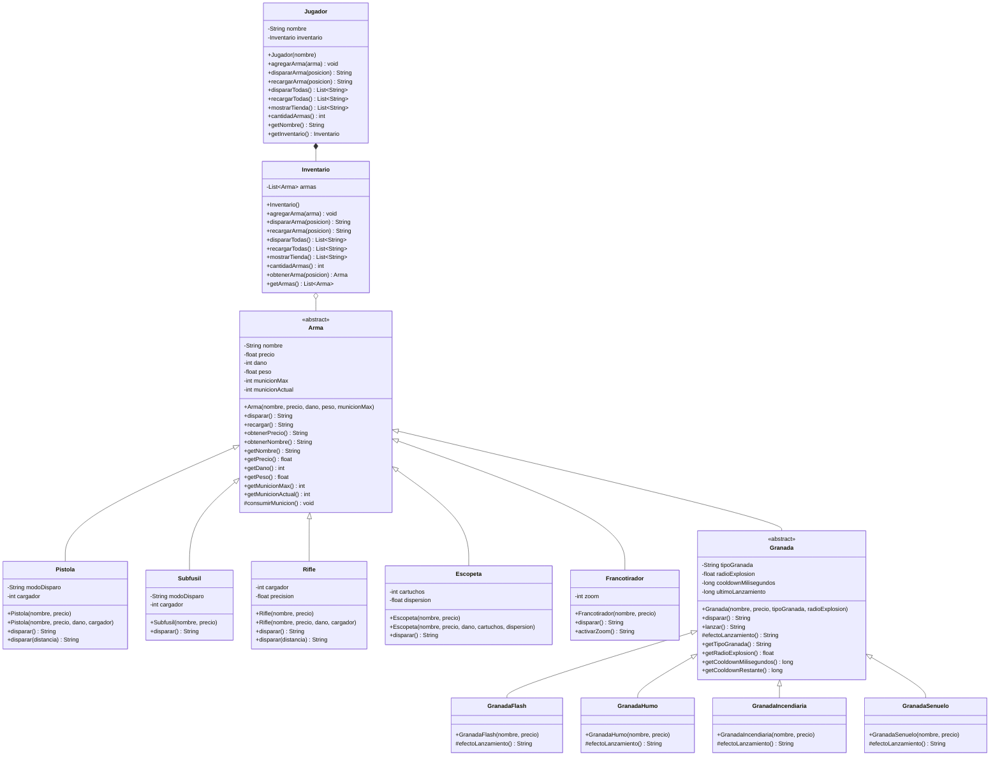

# Taller Git 2026 - API de Armas de Counter-Strike 2

## Descripción

Proyecto desarrollado en Java con Spring Boot para representar diferentes armas de Counter-Strike 2 mediante una API REST.

El proyecto aplica conceptos de programación orientada a objetos, incluyendo:

- Encapsulamiento.
- Herencia.
- Clases abstractas.
- Polimorfismo.
- Sobrecarga de métodos (overloading).
- Sobrescritura de métodos (overriding).
- Constructores simples y sobrecargados.
- Validación de invariantes del dominio.
- Generalización mediante una clase padre.
- Inventario polimórfico.
- Control interno de munición.
- Control interno de cooldown para granadas.

## Tecnologías utilizadas

- Java 21
- Spring Boot
- Maven
- Git
- GitHub
- JUnit 5
- Mermaid

## Estructura del proyecto

El proyecto separa las clases del dominio de los controladores REST.

```text
src/
├── main/
│   └── java/
│       └── com/
│           └── gio/
│               └── cs2api/
│                   ├── Cs2ApiApplication.java
│                   │
│                   ├── domain/
│                   │   ├── Arma.java
│                   │   ├── Inventario.java
│                   │   ├── Jugador.java
│                   │   ├── Pistola.java
│                   │   ├── Subfusil.java
│                   │   ├── Rifle.java
│                   │   ├── Escopeta.java
│                   │   ├── Francotirador.java
│                   │   ├── Granada.java
│                   │   ├── GranadaFlash.java
│                   │   ├── GranadaHumo.java
│                   │   ├── GranadaIncendiaria.java
│                   │   └── GranadaSenuelo.java
│                   │
│                   └── rest/
│                       └── controller/
│                           ├── IndexController.java
│                           ├── ArmaController.java
│                           ├── RifleController.java
│                           └── JugadorController.java
│
└── test/
    └── java/
        └── com/
            └── gio/
                └── cs2api/
                    ├── Cs2ApiApplicationTests.java
                    └── domain/
                        └── RifleTests.java
```

## Diseño orientado a objetos

La clase `Arma` es la clase abstracta principal de la jerarquía.

Todas las armas concretas heredan de ella:

```text
Arma
├── Pistola
├── Subfusil
├── Rifle
├── Escopeta
├── Francotirador
└── Granada
    ├── GranadaFlash
    ├── GranadaHumo
    ├── GranadaIncendiaria
    └── GranadaSenuelo
```

Además, el jugador posee un inventario que trabaja con el tipo general `Arma`:

```text
Jugador
   │
   ▼
Inventario
   │
   ▼
List<Arma>
```

Esto permite almacenar diferentes tipos de armas y ejecutar sus comportamientos mediante polimorfismo.

## Diagrama de clases



## Herencia y polimorfismo

`Arma` es una clase abstracta que define el contrato general de las armas mediante:

```java
public abstract String disparar();
```

Las clases hijas implementan este comportamiento de acuerdo con sus características.

Por ejemplo:

```java
Arma rifle = new Rifle("AK-47", 2700f);
Arma pistola = new Pistola("Glock", 700f);
```

Aunque ambas variables utilizan el tipo padre `Arma`, Java ejecuta la implementación correspondiente a la clase concreta.

```java
rifle.disparar();
pistola.disparar();
```

Esto demuestra polimorfismo y overriding.

## Inventario polimórfico

El inventario utiliza:

```java
private final List<Arma> armas;
```

Por lo tanto, puede contener diferentes tipos de armas sin necesitar un `if` o `switch` para cada tipo.

Por ejemplo, el jugador puede tener:

```java
Arma rifle = new Rifle("AK-47", 2700f);
Arma pistola = new Pistola("Glock", 700f);
Arma escopeta = new Escopeta("Nova", 1050f);
Arma francotirador = new Francotirador("AWP", 4750f);
Arma granada = new GranadaFlash("Flash", 200f);
```

Todas pueden agregarse al mismo inventario:

```java
jugador.agregarArma(rifle);
jugador.agregarArma(pistola);
jugador.agregarArma(escopeta);
jugador.agregarArma(francotirador);
jugador.agregarArma(granada);
```

Después el inventario puede solicitar:

```java
jugador.dispararTodas();
```

sin preguntar qué clase concreta tiene cada objeto.

Cada instancia ejecuta automáticamente su propia implementación de `disparar()`.

Esto evita duplicación de lógica y demuestra el uso del polimorfismo.

## Encapsulamiento y control de estado

Los datos importantes de `Arma` se mantienen privados:

```java
private final String nombre;
private final float precio;
private final int dano;
private final float peso;
private final int municionMax;
private int municionActual;
```

El estado interno no se modifica directamente desde los controladores.

La munición se consume mediante comportamiento de la propia jerarquía:

```java
protected void consumirMunicion()
```

La recarga también está definida en la clase padre:

```java
public String recargar()
```

De esta manera, el control de munición permanece dentro del modelo de dominio.

## Granadas y cooldown

La clase `Granada` concentra el comportamiento común de las granadas.

El control de:

- Munición.
- Cooldown.
- Tiempo transcurrido desde el último lanzamiento.

se mantiene dentro de la clase `Granada`.

Las clases concretas solamente especializan el efecto de lanzamiento:

```java
protected abstract String efectoLanzamiento();
```

Por ejemplo:

```java
@Override
protected String efectoLanzamiento() {
    return obtenerNombre() + " lanza una flash.";
}
```

Esto permite que `GranadaFlash`, `GranadaHumo`, `GranadaIncendiaria` y `GranadaSenuelo` tengan diferentes comportamientos sin duplicar el control de munición y cooldown.

## Overriding

El **overriding** ocurre cuando una clase hija proporciona su propia implementación de un método heredado.

Ejemplo:

```java
@Override
public String disparar() {
    return obtenerNombre() + " realiza un disparo de precisión.";
}
```

En el proyecto, las diferentes armas especializan `disparar()` según su comportamiento.

En las granadas, la clase `Granada` concentra el lanzamiento y las clases hijas especializan:

```java
protected String efectoLanzamiento()
```

De esta forma, la clase padre concentra el contrato y el comportamiento común, mientras las clases hijas aportan su especialización.

## Overloading

El **overloading** ocurre cuando una misma clase posee métodos con el mismo nombre pero diferente lista de parámetros.

En `Rifle` existe:

```java
public String disparar()
```

y:

```java
public String disparar(int distancia)
```

También `Pistola` dispone de las dos formas:

```java
public String disparar()
```

y:

```java
public String disparar(int distancia)
```

La diferencia es:

- **Overriding:** una clase hija redefine un método heredado.
- **Overloading:** una clase tiene varios métodos con el mismo nombre y diferentes parámetros.

## Constructores e invariantes

Las clases del dominio utilizan constructores simples y sobrecargados.

Por ejemplo, `Rifle` posee:

```java
public Rifle(String nombre, float precio)
```

y:

```java
public Rifle(
        String nombre,
        float precio,
        int dano,
        int cargador)
```

El constructor sobrecargado utiliza `super(...)` para inicializar la parte correspondiente a `Arma`.

Las clases también validan los datos recibidos para evitar estados inválidos.

Entre las validaciones implementadas se encuentran:

- El nombre no puede estar vacío.
- El precio no puede ser negativo.
- El daño debe ser válido.
- El peso debe ser mayor que cero.
- La munición máxima debe ser mayor que cero.
- El cargador debe ser mayor que cero.
- La distancia de disparo no puede ser negativa.
- El radio de explosión no puede ser negativo.
- El tipo de granada no puede estar vacío.
- El nombre del jugador no puede estar vacío.
- No se permite agregar un arma `null` al inventario.

## API REST

### Página principal

```text
GET /
```

Devuelve:

```text
API de armas de Counter-Strike 2 funcionando
```

### Crear un arma

```text
GET /armas/{tipo}
```

Ejemplo:

```text
GET /armas/rifle?nombre=AK-47&precio=2700&dano=36&cargador=30
```

La respuesta contiene información del arma y el resultado de ejecutar su comportamiento.

### Demostrar polimorfismo

```text
GET /polimorfismo
```

Este endpoint demuestra el polimorfismo utilizando referencias del tipo padre `Arma` para objetos de diferentes clases hijas.

### Disparar un rifle

```text
GET /rifles/{nombre}/disparar
```

Ejemplo:

```text
GET /rifles/AK-47/disparar?distancia=50
```

Permite utilizar la sobrecarga:

```java
disparar(int distancia)
```

### Inventario de un jugador

```text
GET /jugadores/demo
```

Muestra un jugador de demostración con diferentes tipos de armas dentro de su inventario.

Ejemplo de respuesta:

```json
{
  "jugador": "Jugador Demo",
  "cantidadArmas": 5,
  "armas": [
    {
      "tipo": "Rifle",
      "nombre": "AK-47",
      "precio": 2700.0,
      "municion": 30
    },
    {
      "tipo": "Pistola",
      "nombre": "Glock",
      "precio": 700.0,
      "municion": 12
    }
  ]
}
```

### Disparar todas las armas

```text
GET /jugadores/demo/disparar
```

Solicita a todas las armas del inventario que ejecuten `disparar()`.

No es necesario utilizar un `if` por cada tipo de arma porque el método se resuelve polimórficamente.

### Recargar todas las armas

```text
GET /jugadores/demo/recargar
```

Solicita a todas las armas del inventario que ejecuten:

```java
recargar()
```

### Mostrar tienda

```text
GET /jugadores/demo/tienda
```

Muestra los productos del inventario junto con sus precios.

### Disparar un arma por posición

```text
GET /jugadores/demo/disparar/{posicion}
```

Ejemplo:

```text
GET /jugadores/demo/disparar/0
```

Permite seleccionar un arma del inventario por su posición y ejecutar su comportamiento mediante la referencia general `Arma`.

## Validación de errores

Los valores inválidos son rechazados mediante validaciones del dominio y de los controladores.

Entre los casos considerados se encuentran:

- Daño igual a cero o negativo.
- Cargadores iguales a cero o negativos.
- Distancias negativas.
- Nombres vacíos.
- Precios negativos.
- Parámetros incompletos.
- Posiciones inexistentes dentro del inventario.
- Armas nulas.
- Tipo de granada vacío.
- Radio de explosión negativo.

## Pruebas

Las pruebas automatizadas se ejecutan mediante:

```bash
./mvnw test
```

Resultado actual:

```text
Tests run: 6, Failures: 0, Errors: 0, Skipped: 0
BUILD SUCCESS
```

Las pruebas automatizadas verifican el comportamiento de las clases del dominio, incluyendo constructores, validaciones, consumo de munición y disparo con distancia.

También se realizaron pruebas manuales de los endpoints de la API:

```text
GET /
GET /armas/rifle?nombre=AK-47&precio=2700&dano=36&cargador=30
GET /polimorfismo
GET /rifles/AK-47/disparar?distancia=50
GET /jugadores/demo
GET /jugadores/demo/disparar
GET /jugadores/demo/recargar
GET /jugadores/demo/tienda
```

Los endpoints del jugador fueron probados con un inventario que contiene:

- Rifle.
- Pistola.
- Escopeta.
- Francotirador.
- GranadaFlash.

## Ejecución del proyecto

Para iniciar el servicio:

```bash
./mvnw spring-boot:run
```

La aplicación se ejecuta en:

```text
http://localhost:8080
```

## Bitácora de uso de Inteligencia Artificial

El proyecto contiene el archivo `BITACORA.md` en la raíz del repositorio.

La bitácora documenta:

- Asistente utilizado.
- Proveedor.
- Modelo de LLM.
- Objetivo del uso de IA.
- Resumen de los principales prompts utilizados.
- Participación del estudiante.
- Evidencia de pruebas realizadas.

La herramienta utilizada fue ChatGPT, de OpenAI, utilizando el modelo GPT-5.6 Luna.

## Licencia

Este proyecto está distribuido bajo la licencia **Apache License 2.0**.

El texto completo de la licencia se encuentra en el archivo `LICENSE` del repositorio.

## Repositorio

https://github.com/GioMonteggia/SMONTEGGIA-taller-git-2026

## Commit de solución

La solución final verificada corresponde al siguiente commit:

https://github.com/GioMonteggia/SMONTEGGIA-taller-git-2026/commit/8ed6cf8de1843b29ac3027299ba6ed70369bbe4d

## Autor

**Sergio Monteggia**
