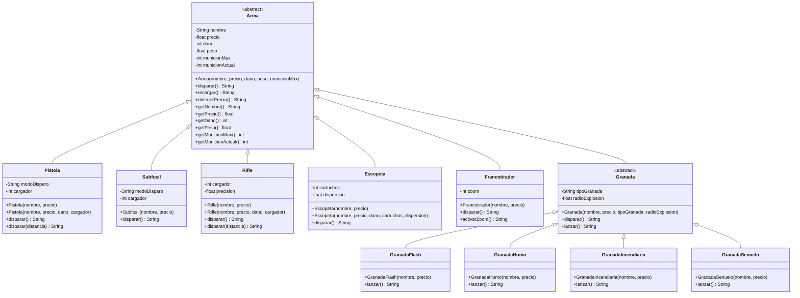

# Taller Git 2026 - API de Armas de Counter-Strike 2

## Descripción

Proyecto desarrollado en Java con Spring Boot para representar diferentes armas de Counter-Strike 2 mediante una API REST.

El proyecto aplica conceptos de programación orientada a objetos, incluyendo:

- Encapsulamiento.
- Herencia.
- Clases abstractas.
- Polimorfismo.
- Sobrecarga de métodos (overloading).
- Sobrescritura de métodos (overriding).
- Constructores simples y sobrecargados.
- Validación de invariantes del dominio.

## Tecnologías utilizadas

- Java 21
- Spring Boot
- Maven
- Git
- GitHub
- JUnit 5
- Mermaid

## Estructura del proyecto

El proyecto separa las clases del dominio de los controladores REST.

```text
src/
├── main/
│   └── java/
│       └── com/
│           └── gio/
│               └── cs2api/
│                   ├── Cs2ApiApplication.java
│                   │
│                   ├── domain/
│                   │   ├── Arma.java
│                   │   ├── Pistola.java
│                   │   ├── Subfusil.java
│                   │   ├── Rifle.java
│                   │   ├── Escopeta.java
│                   │   ├── Francotirador.java
│                   │   ├── Granada.java
│                   │   ├── GranadaFlash.java
│                   │   ├── GranadaHumo.java
│                   │   ├── GranadaIncendiaria.java
│                   │   └── GranadaSenuelo.java
│                   │
│                   └── rest/
│                       └── controller/
│                           ├── IndexController.java
│                           ├── ArmaController.java
│                           └── RifleController.java
│
└── test/
    └── java/
        └── com/
            └── gio/
                └── cs2api/
                    ├── Cs2ApiApplicationTests.java
                    └── domain/
                        └── RifleTests.java
```

## Diagrama de clases



## Herencia y polimorfismo

`Arma` es una clase abstracta que define el comportamiento general de las armas mediante el método abstracto:

```java
public abstract String disparar();
```

Las diferentes clases hijas heredan de `Arma` y proporcionan su propia implementación de `disparar()`.

Por ejemplo:

```java
Arma rifle = new Rifle("AK-47", 2700);
Arma pistola = new Pistola("Glock", 700);

rifle.disparar();
pistola.disparar();
```

Aunque las variables son declaradas como `Arma`, Java ejecuta la implementación correspondiente de cada clase hija. Esto demuestra polimorfismo y sobrescritura de métodos.

## Overriding y Overloading

### Overriding

El **overriding** ocurre cuando una clase hija redefine un método heredado de la clase padre utilizando la misma firma.

Ejemplo:

```java
@Override
public String disparar() {
    return obtenerNombre() + " realiza un disparo de precisión.";
}
```

En este proyecto, `Rifle`, `Pistola`, `Escopeta`, `Subfusil`, `Francotirador` y `Granada` sobrescriben el comportamiento de `disparar()`.

Esto permite que cada tipo de arma tenga un comportamiento diferente utilizando el mismo método definido por la clase abstracta `Arma`.

### Overloading

El **overloading** ocurre cuando una misma clase posee varios métodos con el mismo nombre pero diferente lista de parámetros.

En `Rifle` existe:

```java
public String disparar()
```

y:

```java
public String disparar(int distancia)
```

Ambos realizan la misma acción general, disparar, pero permiten diferentes formas de invocación.

La diferencia principal es:

- **Overriding:** una clase hija redefine un método heredado.
- **Overloading:** una clase tiene varios métodos con el mismo nombre y diferentes parámetros.

## Constructores e invariantes

Las clases del dominio utilizan constructores simples y sobrecargados.

Por ejemplo, `Rifle` posee:

```java
public Rifle(String nombre, float precio)
```

y:

```java
public Rifle(String nombre, float precio, int dano, int cargador)
```

El constructor sobrecargado utiliza `super(...)` para inicializar la parte correspondiente a la clase `Arma`.

Además, los constructores validan los datos recibidos para evitar estados inválidos.

Entre las validaciones implementadas se encuentran:

- El nombre no puede estar vacío.
- El precio no puede ser negativo.
- El daño debe ser mayor que cero para las armas que causan daño.
- El peso debe ser mayor que cero.
- La munición máxima debe ser mayor que cero.
- El cargador debe ser mayor que cero.
- La distancia de disparo no puede ser negativa.
- Los parámetros `dano` y `cargador` deben enviarse juntos cuando se utiliza el constructor correspondiente desde la API.

## API REST

### Página principal

```text
GET /
```

Devuelve un mensaje indicando que la API está funcionando.

Respuesta:

```text
API de armas de Counter-Strike 2 funcionando
```

### Crear un arma

```text
GET /armas/{tipo}
```

Ejemplo:

```text
GET /armas/rifle?nombre=AK-47&precio=2700&dano=36&cargador=30
```

La respuesta contiene información del arma y el resultado de ejecutar su comportamiento `disparar()`.

Ejemplo de respuesta:

```json
{
  "tipo": "Rifle",
  "nombre": "AK-47",
  "precio": 2700.0,
  "dano": 36,
  "peso": 3.7,
  "municionMax": 30,
  "municionActual": 30,
  "mensaje": "AK-47 dispara a 100 m y causa 15 de daño.",
  "municionRestante": 29
}
```

### Demostrar polimorfismo

```text
GET /polimorfismo
```

Este endpoint demuestra el polimorfismo mediante dos objetos de clases hijas tratados como referencias del tipo padre `Arma`.

El controller utiliza:

```java
Arma rifle = new Rifle("AK-47", 2700f);
Arma pistola = new Pistola("Glock", 700f);
```

Ambas instancias son manejadas mediante referencias de tipo `Arma`, pero cada clase hija ejecuta su propia implementación sobrescrita de `disparar()`.

Ejemplo de respuesta:

```json
{
  "rifle": {
    "tipo": "Rifle",
    "mensaje": "AK-47 dispara a 100 m y causa 15 de daño."
  },
  "pistola": {
    "tipo": "Pistola",
    "mensaje": "Glock dispara."
  }
}
```

Esta respuesta permite observar directamente el comportamiento polimórfico de las clases hijas.

### Disparar un rifle

```text
GET /rifles/{nombre}/disparar
```

Ejemplo:

```text
GET /rifles/AK-47/disparar?distancia=50
```

El endpoint permite utilizar la sobrecarga:

```java
disparar(int distancia)
```

También se puede utilizar `disparar()` cuando no se proporciona una distancia.

### Validación de errores

Los valores inválidos son rechazados mediante respuestas HTTP `400`.

Ejemplo:

```text
GET /armas/rifle?dano=0&cargador=30
```

produce una respuesta de error indicando que el daño no puede ser cero o negativo.

También se validan valores como:

- Cargadores iguales a cero o negativos.
- Daño igual a cero o negativo.
- Distancias negativas.
- Nombres vacíos.
- Precios negativos.
- Parámetros incompletos.

## Pruebas

Las pruebas automatizadas se ejecutan mediante:

```bash
./mvnw test
```

Resultado obtenido:

```text
Tests run: 6, Failures: 0, Errors: 0, Skipped: 0
BUILD SUCCESS
```

Las pruebas automatizadas verifican principalmente:

- Constructor simple de `Rifle`.
- Constructor sobrecargado de `Rifle`.
- Validación de estados inválidos.
- Consumo de munición.
- Comportamiento de `disparar(int distancia)`.
- Atenuación del daño según la distancia.

También se realizaron pruebas manuales de los principales endpoints HTTP, incluyendo:

```text
GET /
GET /armas/rifle?nombre=AK-47&precio=2700&dano=36&cargador=30
GET /polimorfismo
GET /rifles/AK-47/disparar?distancia=50
```

## Ejecución del proyecto

Para iniciar el servicio:

```bash
./mvnw spring-boot:run
```

La aplicación se ejecuta en:

```text
http://localhost:8080
```

## Bitácora de uso de Inteligencia Artificial

El proyecto contiene el archivo `BITACORA.md` en la raíz del repositorio.

La bitácora documenta:

- Asistente utilizado.
- Proveedor.
- Modelo de LLM.
- Objetivo del uso de IA.
- Resumen de los principales prompts utilizados.
- Participación del estudiante.
- Evidencia de pruebas realizadas.

La herramienta utilizada fue ChatGPT, de OpenAI, utilizando el modelo GPT-5.6 Luna.

## Licencia

Este proyecto está distribuido bajo la licencia **Apache License 2.0**.

El texto completo de la licencia se encuentra en el archivo `LICENSE` del repositorio.

## Repositorio

https://github.com/GioMonteggia/SMONTEGGIA-taller-git-2026

## Commit de la solución

El enlace al commit final de la solución se incorporará después de finalizar todos los cambios y pruebas de la entrega.

## Autor

**Sergio Monteggia**
